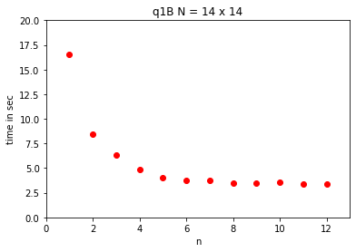
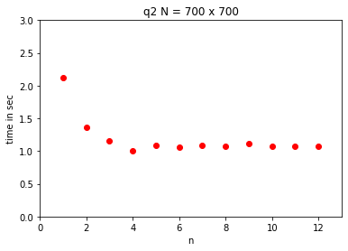
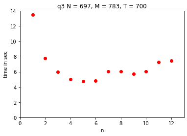

# DS Assignment 1

## Parallel Programs using OpenMPI

## Performance Analysis

### Q1 B
- Time Complexity: $O(N! / P)$
- Space Complexity: $O(N * N * P)$
- Message complexity:
    - One broadcast and one reduction operation per process require $O(P+P)$ messages. Hence, overall complexity is $O(P)$.
- Performance scaling: 
    - Initially, the performance exhibits linear scaling with the number of processes. However, as the number of processes increases, performance begins to decline. This phenomenon arises due to the escalation in the number of messages accompanying the increase in processes, consequently increasing the time required for sending and receiving messages.

### Q2
- Time Complexity: $O(N * N * N / P)$
- Space Complexity: $O(N * N * P)$
- Message Complexity: 
  - AllGatherV for column $O(P * N)$ Broadcast $O(P * N)$ and Reduce $O(P)$ = $O(N * P)$
  - In terms of size $O(N * N * P)$
- Performance Scaling: 
    - At first, performance demonstrates linear scaling with the initial increase in the number of processes. However, it subsequently begins to diminish as more processes are added. This decline occurs due to the escalating number of messages associated with the increase in processes, consequently prolonging the time required for message transmission and reception.

### Q3
- Time Complexity: $O(N * M * T / P)$
- Space Complexity: $O(N * M * P)$
- Message Complexity: 
  - Broadcast in the begining $O(P)$ + Sending and receiving last row to next/previous process. $O(P * T)$ + Reduce in the end $O(P)$ = $O(P * T + P)$
  - In terms of size $O(N * M * P + N * P * T)$
- Performance Scaling: 
    - Initially, performance demonstrates linear scaling with the number of processes, but it begins to decline as the number of processes increases. In fact, it can even increase for larger values of $P$ because all processes must wait for other processes to exchange messages. This phenomenon arises due to the increase in the number of messages accompanying the increase in processes, thereby prolonging the time required for message transmission and reception.
